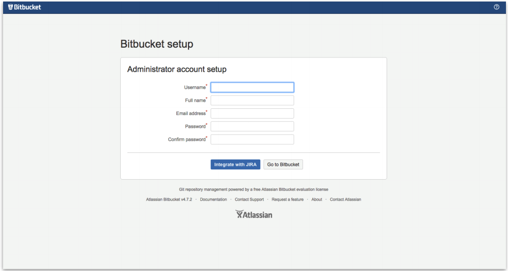

. Choose the URL that is displayed in the *Outputs* tab of the AWS CloudFormation stack to go to the {partner-product-name-short} configuration page.
+
IMPORTANT: If you get an https://confluence.atlassian.com/kb/network-and-connectivity-troubleshooting-guide-720405335.html[HTTP Error 503] response when you access the URL, it means that {partner-product-name-short} is still loading. This is expected, and you should wait a couple of minutes before trying again.
. On the *Licensing and Settings* page, enter a title for your Bitbucket deployment. Leave the base URL unchanged, and choose the appropriate licensing option. If you don’t have a valid license for Bitbucket Data Center, sign up for an evaluation license.
+
.Licensing and settings
image::../images/qs-bb-config-step2-licensing.png[width=640]
. To set up Bitbucket Data Center, you need to create an Administrator account and password. The Administrator account has full access to all data in Bitbucket, so we highly recommend that you choose a strong password for this account. Enter your Administrator’s user details in the *Administrator account setup screen*, and choose *Go to Bitbucket*.
+
.Administrator account setup

. Log in with the user name and credentials you created in the previous step.
+
.Log in
image::../images/qs-bb-config-step4-login.png[width=640]
. Choose image:icon-gear.png[] *> Clustering*. You should see the <<clustering1>> page, which shows that your cluster has one node.
+
[#clustering1]
.Clustering (one node)
image::../images/qs-bb-config-step5-sndc.png[width=640]

Your {partner-product-name} deployment is now in a state where you can add nodes that will automatically cluster with your existing node.
